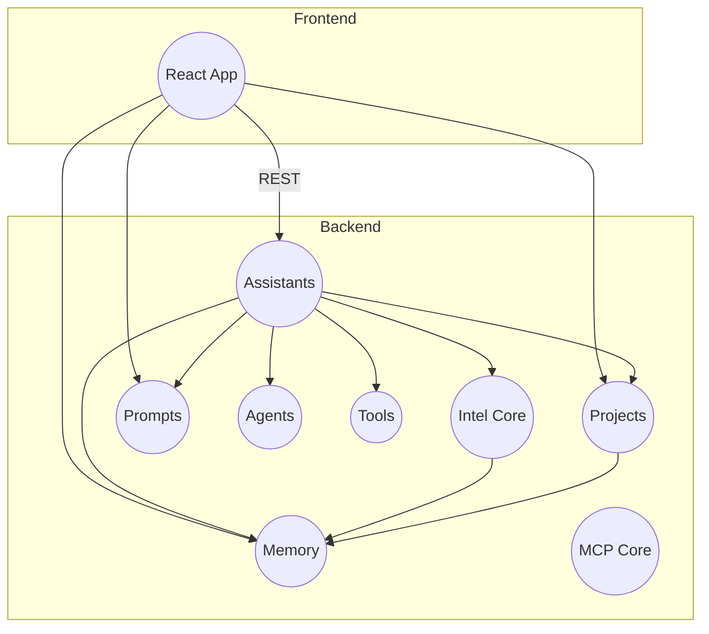

# System Architecture

```mermaid
flowchart TD
    subgraph Backend
        assistants((Assistants))
        memory((Memory))
        intel_core((Intel Core))
        mcp_core((MCP Core))
        projects((Projects))
        prompts((Prompts))
        agents((Agents))
        tools((Tools))
    end

    subgraph Frontend
        reactApp((React App))
    end

    reactApp -->|REST| assistants
    reactApp --> memory
    reactApp --> projects
    reactApp --> prompts
    assistants --> memory
    assistants --> intel_core
    assistants --> projects
    assistants --> prompts
    assistants --> agents
    assistants --> tools
    intel_core --> memory
    projects --> memory
```
